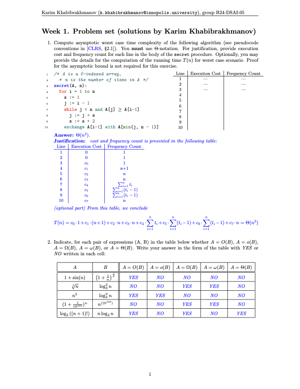
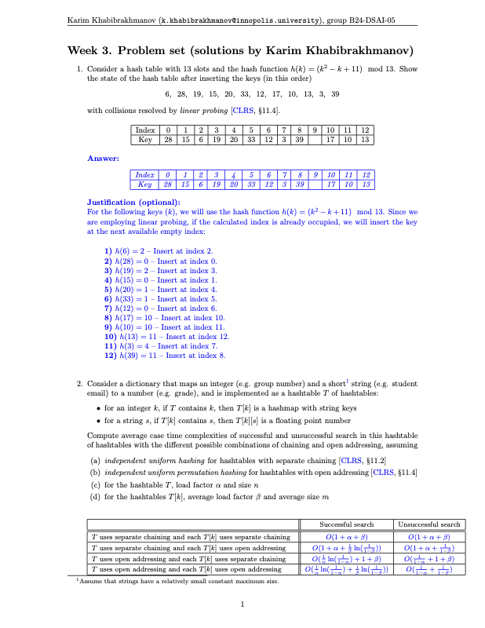
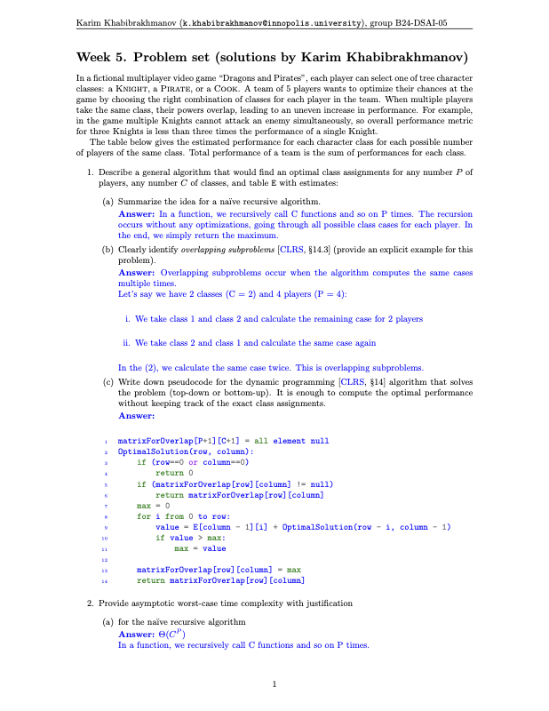
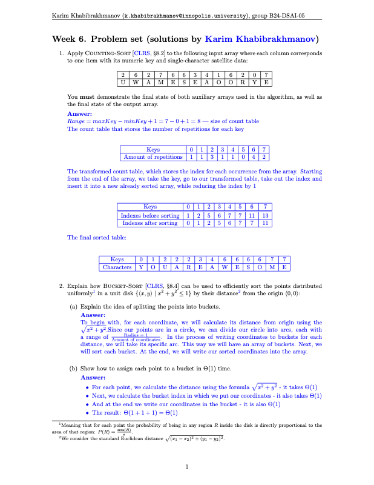
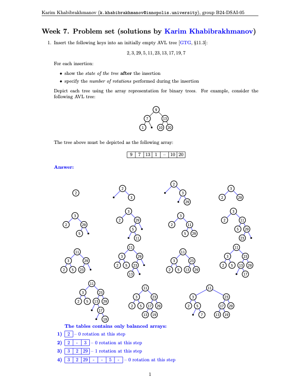
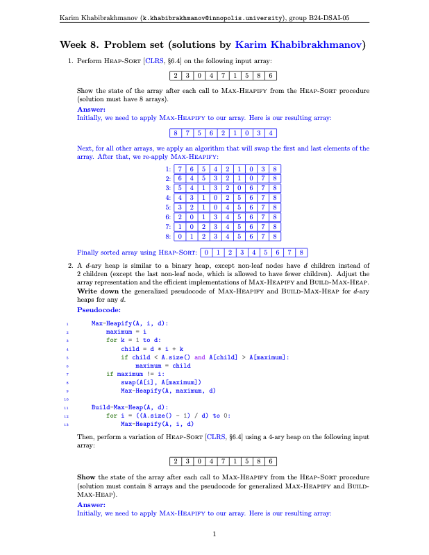
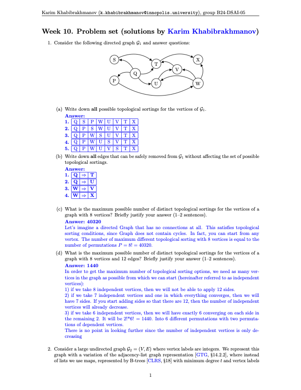
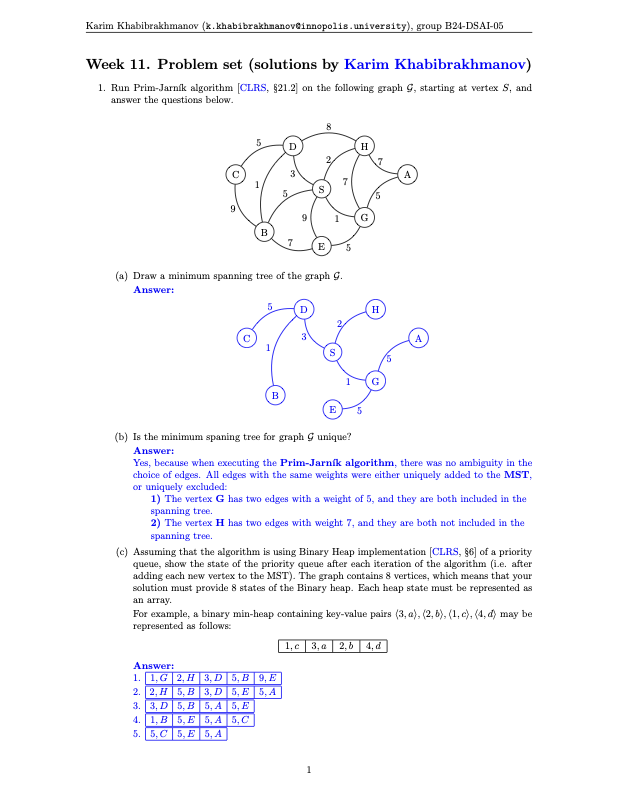
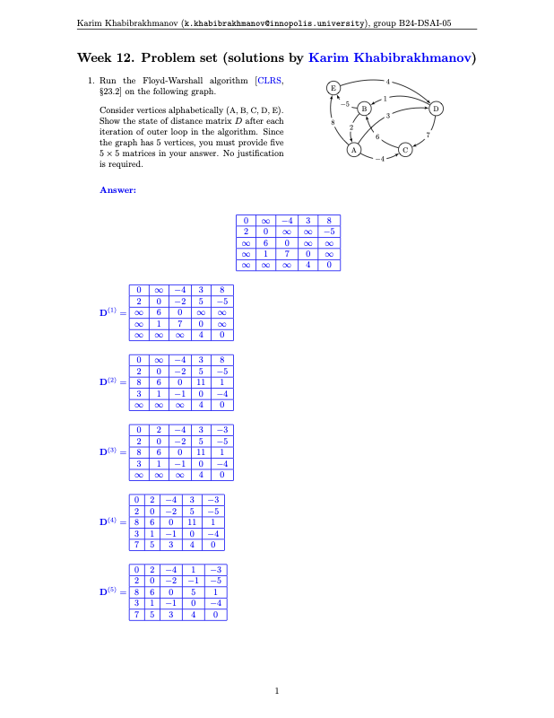

# Data Structures and Algorithms (Innopolis University)

Weekly problem sets and solutions. Each week lives in its own folder; task screenshots are included when available.

## Weeks

### Week 1

- Folder: `Week_1/`
- Tasks: `Week_1/README.md`

### Week 2

- Folder: `Week_2/`
- Tasks: `Week_2/README.md`

### Week 3

- Folder: `Week_3/`
- Tasks: `Week_3/README.md`

### Week 4

- Folder: `Week_4/`
- Tasks: `Week_4/README.md`

### Week 5

- Folder: `Week_5/`
- Tasks: `Week_5/README.md`

### Week 6

- Folder: `Week_6/`
- Tasks: `Week_6/README.md`

### Week 7

- Folder: `Week_7/`
- Tasks: `Week_7/README.md`

### Week 8

- Folder: `Week_8/`

### Week 10

- Folder: `Week_10/`
- Tasks: `Week_10/README.md`

### Week 11

- Folder: `Week_11/`
- Tasks: `Week_11/README.md`

### Week 12

- Folder: `Week_12/`
